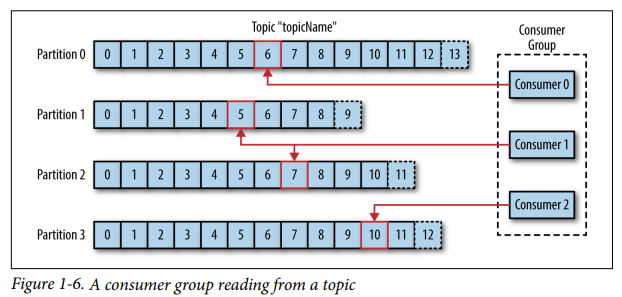

# kafka-cluster
Источники: 
[Работа Apache Kafka на примерах. Поднимаем Kafka Cluster используя docker-compose](https://habr.com/ru/articles/738874/)

[Apache Kafka и Spring Boot: лёгкая интеграция](https://habr.com/ru/companies/slurm/articles/772818/)

[Kafka: The Definitive Guide](https://assets.confluent.io/m/1b509accf21490f0/original/20170707-EB-Confluent_Kafka_Definitive-Guide_Complete.pdf)

### Важные свойства конфигурации потребителя для надежной обработки
Существует **четыре свойства** конфигурации потребителя, которые важно понимать, чтобы настроить потребителя для желаемого поведения надежности. 
**Первое** — `group.id`, как подробно объяснено в _Главе 4_. Основная идея заключается в том, что если два потребителя имеют 
одинаковый идентификатор группы и подписаны на одну и ту же тему, каждому будет назначено подмножество разделов в топике 
(т.е. всего несколько партиций из всего количества), и поэтому они будут читать только подмножество сообщений по отдельности 
(но все сообщения будут читаться группой в целом). 
Если вам нужно, чтобы потребитель видел, сам по себе, каждое сообщение в темах, на которые он подписан, ему понадобится уникальный `group.id`. 
**Вторая** соответствующая конфигурация — `auto.offset.reset`. Этот параметр управляет тем, что будет делать потребитель, 
когда смещения не были зафиксированы (например, когда потребитель впервые запускается) или когда потребитель запрашивает 
смещения, которых нет в брокере (_Глава 4_ объясняет, как это может произойти). 
Здесь есть только два варианта. Если вы выберете `earlier`, потребитель начнет с начала раздела, когда у него нет допустимого 
смещения. Это может привести к тому, что потребитель будет обрабатывать много сообщений дважды, но это гарантирует минимизацию 
потери данных. Если вы выберете `latest`, потребитель начнет с конца раздела. Это сводит к минимуму дублирующую обработку 
потребителем, но почти наверняка приведет к тому, что некоторые сообщения будут пропущены потребителем. 
**Третья** соответствующая конфигурация — `enable.auto.commit`. 
_Это важное решение_: позволите ли вы потребителю фиксировать смещения за вас на основе расписания или планируете фиксировать смещения вручную в своем коде? 
Главное преимущество автоматических фиксаций смещения заключается в том, что при реализации ваших потребителей становится на одну проблему меньше. 
Если вы выполняете всю обработку потребляемых записей в цикле опроса потребителей, то автоматическая фиксация смещения гарантирует, что вы никогда не 
зафиксируете смещение, которое вы не обработали. (Если вы не уверены, что такое цикл опроса потребителей, вернитесь к _Главе 4._) 
Главным недостатком автоматических фиксаций смещения является то, что вы не можете контролировать количество дубликатов записей, которые вам может 
потребоваться обработать (потому что ваш потребитель остановился после обработки некоторых записей, но до того, как сработала автоматическая фиксация). 
Если вы делаете что-то необычное, например, передаете записи в другой поток для обработки в фоновом режиме, автоматическая фиксация может фиксировать 
смещения для записей, которые потребитель прочитал, но, возможно, еще не обработал. 
**Четвертая** соответствующая конфигурация связана с третьей и называется `auto.com mit.interval.ms`. 
Если вы решили автоматически фиксировать смещения, эта конфигурация позволяет вам настроить частоту их фиксации. 
Значение по умолчанию — каждые пять секунд (5 sec). В целом, более частая фиксация добавляет некоторые накладные расходы, 
но уменьшает количество дубликатов, которые могут возникнуть при остановке потребителя. 

### Consumer
Потребители работают как часть группы потребителей, которая состоит из одного или нескольких потребителей, работающих вместе 
для потребления темы. Группа гарантирует, что каждый раздел потребляется только одним участником. На рисунке 1-6 в одной группе есть 
три потребителя, потребляющих тему. Двое из потребителей работают с одним разделом каждый, в то время как третий потребитель 
работает с двумя разделами (partitions). Сопоставление потребителя с разделом (partition) часто называется владением разделом потребителем. 

<!---  --->
<!--  -->

### Явное фиксирование смещений в Consumers (Explicitly Committing Offsets in Consumers)
Если вы используете автоматическую фиксацию смещения, вам не нужно беспокоиться о явной фиксации смещений. Но вам нужно подумать о том, как вы будете фиксировать смещения, если решите, что вам нужно больше контролировать время фиксации смещения — либо для того, чтобы свести к минимуму дублирование, либо потому, что вы выполняете обработку событий вне основного цикла опроса потребителей. 

### Configuring Consumers
[3.4 Consumer Configs](https://kafka.apache.org/documentation.html#consumerconfigs)

### fetch.max.wait.ms
Устанавливая `fetch.min.bytes`, вы сообщаете Kafka, что нужно подождать, пока не будет достаточно данных для отправки, 
прежде чем отвечать потребителю. `fetch.max.wait.ms` позволяет вам контролировать время ожидания. По умолчанию Kafka будет ждать до _500 мс_. 
Это приводит к дополнительной задержке до _500 мс_ в случае, если в тему Kafka поступает недостаточно данных для удовлетворения минимального 
объема возвращаемых данных. Если вы хотите ограничить потенциальную задержку (обычно из-за SLA, контролирующих максимальную задержку 
приложения), вы можете установить `fetch.max.wait.ms` на меньшее значение. Если вы установите `fetch.max.wait.ms` на _100 мс_, а `fetch.min.bytes` на _1 МБ_, 
Kafka получит запрос на выборку от потребителя и ответит данными либо когда у него будет _1 МБ_ данных для возврата, либо по истечении _100 мс_, 
в зависимости от того, что произойдет раньше. 

### max.partition.fetch.bytes
Это свойство управляет максимальным количеством байтов, которые сервер вернет на раздел. Значение по умолчанию — _1 МБ_, 
что означает, что когда `KafkaConsumer.poll()` возвращает `ConsumerRecords`, объект записи будет использовать не более `max.partition.fetch.bytes` 
на раздел, назначенный потребителю. Таким образом, если тема имеет _20_ разделов, а у вас есть _5_ потребителей, каждому потребителю потребуется _4 МБ_ 
памяти, доступной для ConsumerRecords. На практике вам нужно будет выделить больше памяти, так как каждому потребителю потребуется обрабатывать 
больше разделов, если другие потребители в группе выйдут из строя. `max.partition.fetch.bytes` должно быть больше, чем 
самое большое сообщение, которое примет брокер (определяется свойством `max.message.size` в конфигурации брокера), иначе 
у брокера могут быть сообщения, которые потребитель не сможет обработать, и в этом случае потребитель зависнет, пытаясь их прочитать. 
Еще одним важным соображением при настройке `max.partition.fetch.bytes` является количество времени, которое требуется потребителю 
для обработки данных. Как вы помните, потребитель должен вызывать `poll()` достаточно часто, чтобы избежать тайм-аута сеанса и 
последующей перебалансировки. Если объем данных, возвращаемых одним `poll()`, очень большой, потребителю может потребоваться 
больше времени для обработки, что означает, что он не успеет перейти к следующей итерации цикла опроса, чтобы избежать 
тайм-аута сеанса. Если это произойдет, есть **два варианта**: либо уменьшить `max.partition.fetch.bytes`, либо увеличить тайм-аут сеанса `session.timeout.ms`. 

### session.timeout.ms
Время, в течение которого потребитель может быть вне связи с брокерами, при этом оставаясь живым, по умолчанию равно _3 секундам_. 
Если потребитель не отправляет тактовый сигнал координатору группы в течение более чем `session.timeout.ms`, он считается мертвым, 
и координатор группы инициирует перебалансировку группы потребителей для выделения разделов от мертвого потребителя другим 
потребителям в группе. Это свойство тесно связано с `heartbeat.interval.ms`. `heartbeat.interval.ms` управляет частотой отправки 
тактового сигнала методом `KafkaConsumer.poll()` координатору группы, тогда как `session.timeout.ms` управляет временем, 
в течение которого потребитель может не отправлять тактовый сигнал. Поэтому эти два свойства обычно изменяются вместе — `heatbeat.interval.ms` 
должно быть меньше `session.timeout.ms` и обычно устанавливается _на одну треть от значения тайм-аута_. Таким образом, если 
`session.timeout.ms` равно _3 секундам_, `heartbeat.interval.ms` должно быть равно _1 секунде_. Установка `session.timeout.ms` ниже 
значения по умолчанию позволит группам потребителей быстрее обнаруживать и восстанавливаться после сбоя, но также может вызвать 
нежелательные перебалансировки из-за того, что потребителям потребуется больше времени для завершения цикла опроса или сборки мусора. 
Установка `session.timeout.ms` выше уменьшит вероятность случайной перебалансировки, но также означает, что для обнаружения 
реального сбоя потребуется больше времени.

### auto.offset.reset
Это свойство управляет поведением потребителя, когда он начинает читать раздел, для которого у него нет зафиксированного смещения, или 
если зафиксированное смещение, которое у него есть, недействительно (обычно потому, что потребитель был выключен так долго, что запись 
с этим смещением уже устарела для брокера). Значение по умолчанию — «`latest`», что означает, что при отсутствии действительного 
смещения потребитель начнет читать с самых новых записей (**записей, которые были записаны после того, как потребитель начал работать**). 
Альтернативой является «`earliest`», что означает, что при отсутствии действительного смещения потребитель будет читать все данные в разделе, 
начиная с самого начала.

### enable.auto.commit
Ранее в этой главе мы обсуждали различные варианты фиксации смещений. Этот параметр управляет тем, будет ли потребитель автоматически 
фиксировать смещения, и по умолчанию имеет значение `true`. Установите его в `false`, если вы предпочитаете контролировать, 
когда будут фиксироваться смещения, что необходимо для минимизации дубликатов и избежания потери данных. Если вы установите `enable.auto.commit` 
в `true`, то вы также можете захотеть контролировать, как часто будут фиксироваться смещения с помощью `auto.commit.interval.ms`.

### partition.assignment.strategy
Мы узнали, что разделы назначаются потребителям в группе потребителей. `PartitionAssignor` — это класс, который, учитывая 
потребителей и темы, на которые они подписаны, решает, какие partitions (разделы) будут назначены какому потребителю. 
По умолчанию в Kafka есть две стратегии назначения:
- **Range**
- - Назначает каждому потребителю последовательный подмножество разделов из каждой темы, на которую он подписан. 
Таким образом, если потребители C1 и C2 подписаны на две темы, T1 и T2, и каждая из тем имеет три раздела, то C1 будут 
назначены разделы 0 и 1 из тем T1 и T2, в то время как C2 будет назначен раздел 2 из этих тем. Поскольку каждая тема имеет 
нечетное количество разделов и назначение выполняется для каждой темы независимо, первый потребитель в итоге получает больше 
разделов, чем второй. Это происходит всякий раз, когда используется назначение Range, и количество потребителей не делит 
количество разделов в каждой теме аккуратно.
- **RoundRobin**
- - Берет все разделы из всех подписанных тем и назначает их потребителям последовательно, один за другим. Если бы C1 и C2 
описали ранее использованное назначение RoundRobin, C1 имел бы разделы 0 и 2 из темы T1 и раздел 1 из темы T2. C2 имел бы 
раздел 1 из темы T1 и разделы 0 и 2 из темы T2. В общем случае, если все потребители подписаны на одни и те же темы (очень 
распространенный сценарий), назначение RoundRobin приведет к тому, что все потребители будут иметь одинаковое количество 
разделов (или не более 1 разницы в разделе).

`partition.assignment.strategy` позволяет вам выбрать стратегию назначения разделов. По умолчанию используется `org.apache.kafka.clients.consumer.RangeAssignor`, 
который реализует стратегию Range, описанную выше. Вы можете заменить ее на `org.apache.kafka.clients.consumer.RoundRobinAssignor`. 
Более продвинутый вариант — реализовать собственную стратегию назначения, в этом случае `partition.assignment.strategy` должен указывать на имя вашего класса.

### client.id
Это может быть любая строка, и она будет использоваться брокерами для идентификации сообщений, отправленных клиентом. 
Она используется в логировании и метриках, а также для квот.

### max.poll.records
Это контролирует максимальное количество записей, которые вернет один вызов `poll()`. Это полезно для контроля объема данных, 
которые вашему приложению необходимо будет обработать в цикле опроса.

### receive.buffer.bytes and send.buffer.bytes
Это размеры буферов отправки и приема TCP, используемых сокетами при записи и чтении данных. Если они установлены на -1, будут 
использоваться значения ОС по умолчанию. Может быть хорошей идеей увеличить их, когда производители или потребители взаимодействуют 
с брокерами в другом центре обработки данных, поскольку эти сетевые соединения обычно имеют большую задержку и меньшую пропускную 
способность.

### consumer.config
Это конфигурация для всех потребителей, которые будут извлекать данные из исходного кластера. 
Они все совместно используют один файл конфигурации, что означает, что у вас может быть только один исходный кластер и один `group.id`. 
Таким образом, все потребители будут частью одной группы потребителей, что и нужно. Обязательными конфигурациями в файле 
являются `bootstrap.servers` (для исходного кластера) и `group.id`. Но вы можете использовать любую дополнительную конфигурацию для потребителей. 
Единственная конфигурация, которую вы не хотите трогать, — это `auto.commit.enable=false`. MirrorMaker зависит от его способности 
фиксировать собственные смещения после того, как они благополучно прибудут в целевой кластер Kafka. Изменение этого параметра может 
привести к потере данных. Одна конфигурация, которую вы действительно хотите изменить, — это `auto.offset.reset`. 
По умолчанию это значение `latest`, что означает, что MirrorMaker будет зеркалировать только события, поступившие в исходный 
кластер после запуска MirrorMaker. Если вы хотите также зеркалировать существующие данные, измените это значение на `earlier`. 
Дополнительные свойства конфигурации мы обсудим в разделе _«Настройка MirrorMaker» на стр. 175_.

